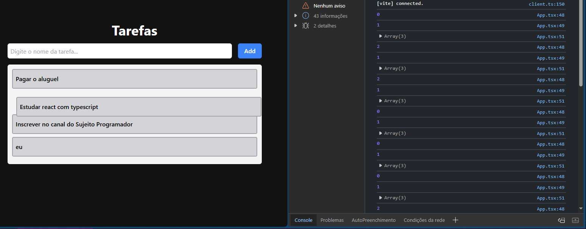

# drag_and_drop

clicar e arrastar, mudar ordem da lista

Este projeto implementa uma lista de tarefas com funcionalidade de arrastar e soltar usando a biblioteca `@hello-pangea/dnd`. Foi baseado na aula do canal Sujeito Programador, que pode ser assistida [neste vídeo](https://www.youtube.com/watch?v=0IAJjjxMFPo&t=774s).

## Descrição

O projeto permite a criação de tarefas e a reorganização das mesmas através de drag and drop. O componente `Task` exibe uma tarefa em uma lista que pode ser arrastada e movida para diferentes posições.

## Imagem



## Tecnologias Utilizadas

- **React**: Biblioteca JavaScript para construir interfaces de usuário.
- **@hello-pangea/dnd**: Biblioteca para funcionalidades de arrastar e soltar.
- **CSS**: Para estilização dos componentes.

## Como Usar

1. Clone o repositório:
   ```bash
   git clone https://github.com/SEU_USUARIO/task-drag-drop.git
   ```
2. Navegue até o diretório do projeto:
   ```bash
   cd drag_and_drop
   ```
3. Instale as dependências:
   ```bash
   npm install ou yarn install
   ```
4. Inicie o projeto:
   ```bash
   npm run dev ou yarn start
   ```
